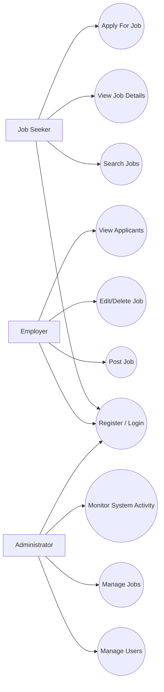
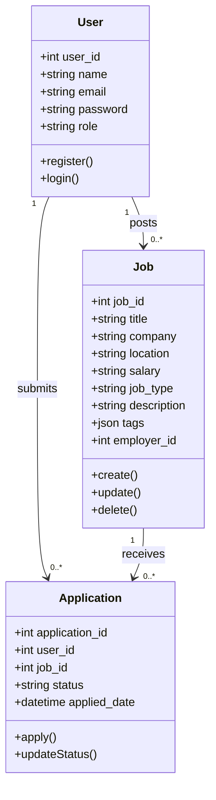
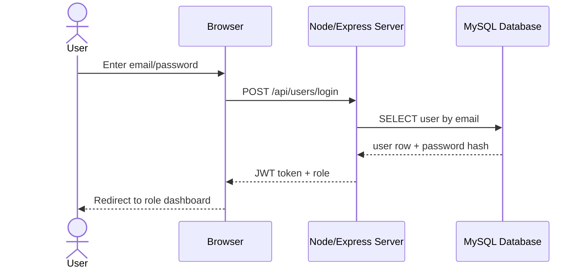
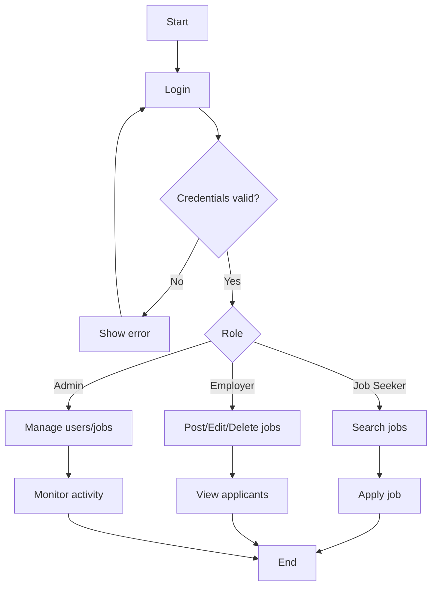

# Job Portal UML Diagrams

## Use Case Diagram

```mermaid
flowchart LR
  JS[Job Seeker]
  EMP[Employer]
  ADM[Administrator]

  UC1((Register / Login))
  UC2((Search Jobs))
  UC3((View Job Details))
  UC4((Apply For Job))
  UC5((Post Job))
  UC6((Edit/Delete Job))
  UC7((View Applicants))
  UC8((Manage Users))
  UC9((Manage Jobs))
  UC10((Monitor System Activity))

  JS --> UC1
  JS --> UC2
  JS --> UC3
  JS --> UC4

  EMP --> UC1
  EMP --> UC5
  EMP --> UC6
  EMP --> UC7

  ADM --> UC1
  ADM --> UC8
  ADM --> UC9
  ADM --> UC10
```

## Class Diagram

```mermaid
classDiagram
  class User {
    +int user_id
    +string name
    +string email
    +string password
    +string role
    +register()
    +login()
  }

  class Job {
    +int job_id
    +string title
    +string company
    +string location
    +string salary
    +string job_type
    +string description
    +json tags
    +int employer_id
    +create()
    +update()
    +delete()
  }

  class Application {
    +int application_id
    +int user_id
    +int job_id
    +string status
    +datetime applied_date
    +apply()
    +updateStatus()
  }

  User "1" --> "0..*" Job : posts
  User "1" --> "0..*" Application : submits
  Job "1" --> "0..*" Application : receives
```

## Sequence Diagram (Login Flow)

```mermaid
sequenceDiagram
  actor U as User
  participant B as Browser
  participant S as Node/Express Server
  participant D as MySQL Database

  U->>B: Enter email/password
  B->>S: POST /api/users/login
  S->>D: SELECT user by email
  D-->>S: user row + password hash
  S-->>B: JWT token + role
  B-->>U: Redirect to role dashboard
```

## Activity Diagram (Login -> Role Actions)

```mermaid
flowchart TD
  A[Start] --> B[Login]
  B --> C{Credentials valid?}
  C -- No --> D[Show error]
  D --> B
  C -- Yes --> E{Role}
  E -- Job Seeker --> F[Search jobs]
  F --> G[Apply job]
  E -- Employer --> H[Post/Edit/Delete jobs]
  H --> I[View applicants]
  E -- Admin --> J[Manage users/jobs]
  J --> K[Monitor activity]
  G --> L[End]
  I --> L
  K --> L
```
